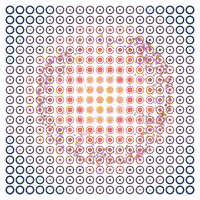
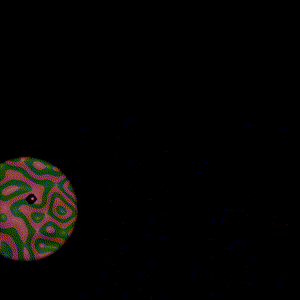
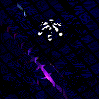
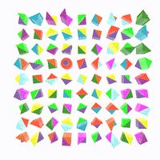

# lookbook

A collection of digital sketches. Blender, P5.js, Godot ... anything goes. Click a thumbnail below to read more about each sketch. 

Inside the `src` folder for each project you'll find the source file. 

|  |  |  |
|---|---|---|
|  |  |  | 
|  |  |  | 
|  |  |  | 
|  |  |  | 
|  |  |  | 

Generated with the [readme generator](./export-scripts/generate-readme.sh).

## Notes
Beyond a (very) few exceptions. Nothing in here should be larger than 5mb.
Check with `find . -type f -size +5M ! -path '*/node_modules/*'`
