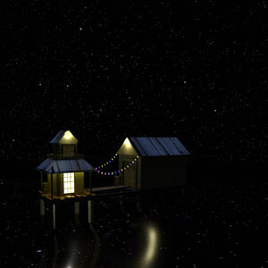
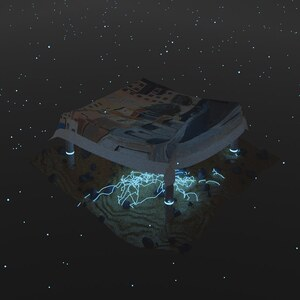
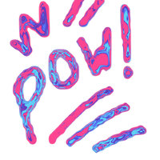
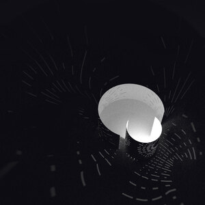
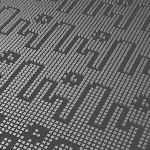
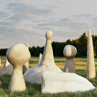
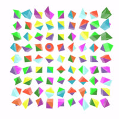
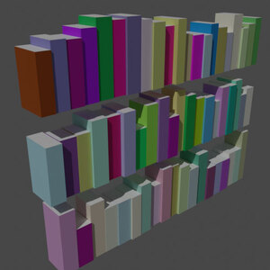
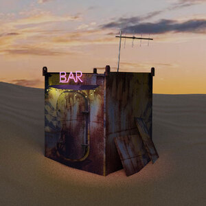
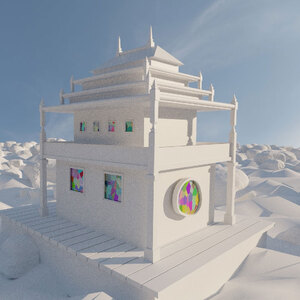

# digital sketchbook

A collection of experiments.

## Exporting

Export scripts have been moved to `export-scripts/README.md`.

## Notes
Beyond a (very) few exceptions. Nothing in here should be larger than 5mb.
Check with `find . -type f -size +5M ! -path '*/node_modules/*'`

|  |  |  |
|---|---|---|
|  |  |  | 
|  |  |  | 
|  |  |  | 
|  |  |  | 
|  |  |  | 
