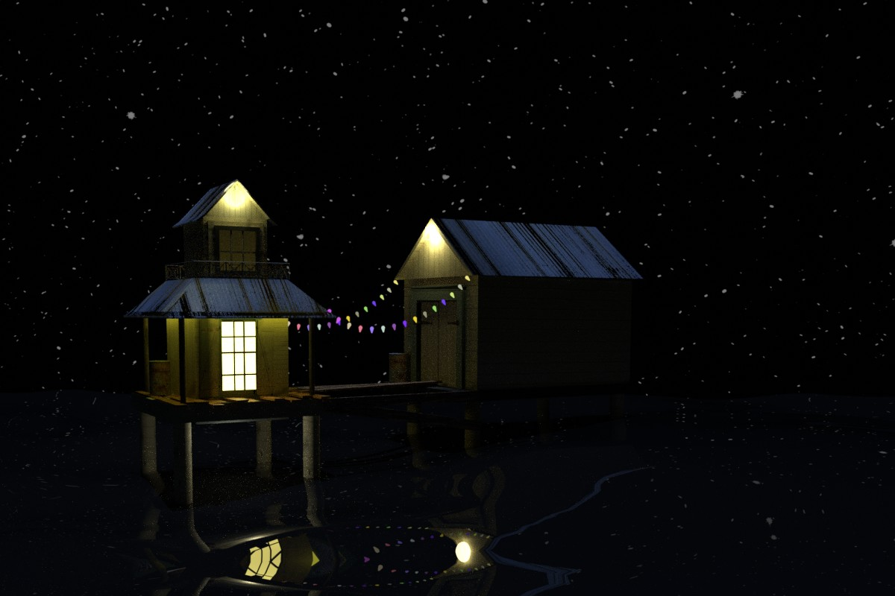
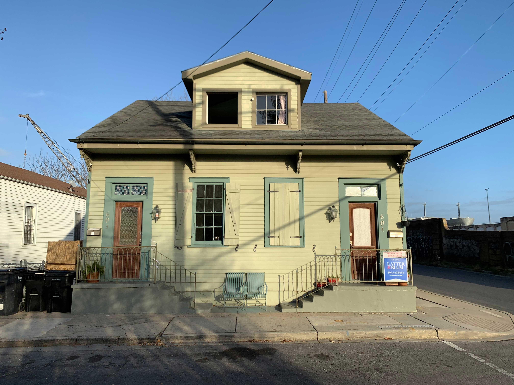

# 603 Float

The idea here was a lot more interesting than the result. The original plan was to take a photo of the apartment we were living in and remake it into a new building. I ended up adding more textures and kind of losing the plot in the process, but still a fun bit of modeling.

