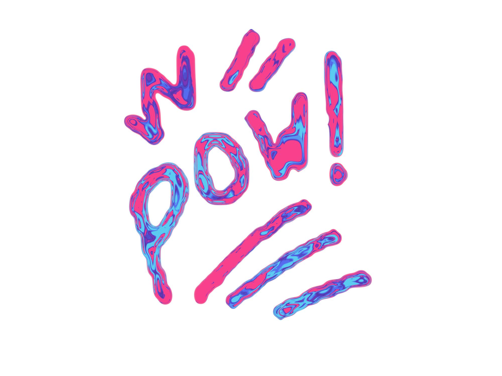

# Geo Node Pen

This is more of a template for future work than an actual project, but it takes a fairly simple principle–that you can use geometry nodes to apply practically anything to a curve–and runs with it a bit. Original concept thanks to [Corey Corza](https://coreycorza.gumroad.com). 

(_Really_ fun with an iPad and Apple Pencil.)

