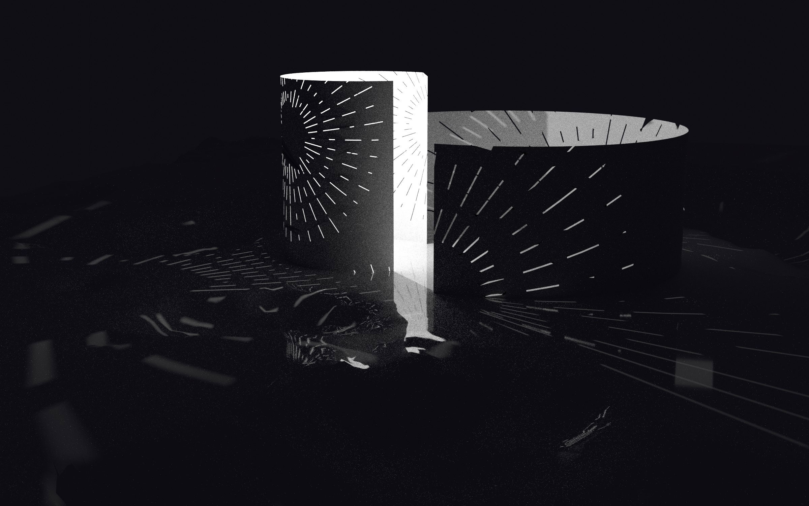
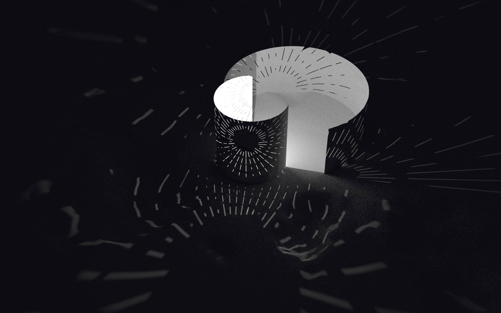
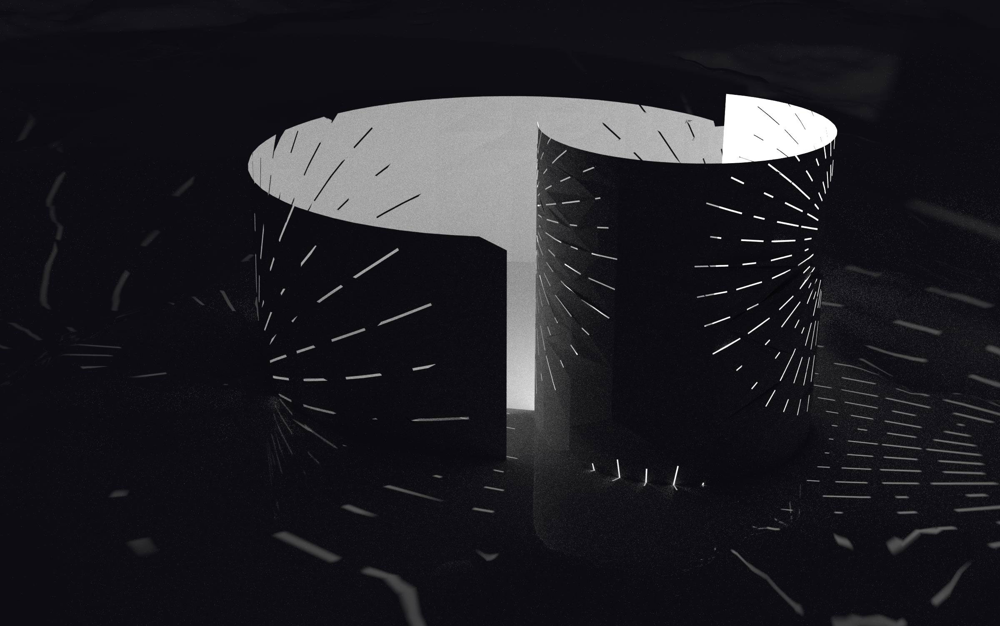

# Lantern Pattern

After spending a year submerged in landscape architecture textbooks (for a school paper) I started thinking thinking more about light as _part_ of the architecture. What emerged was a series of Turrell-ish explorations that I hope to return to at some point.

This is another project that uses [Pattern Nodes](https://lostminds.com/patternodes3/) to create a parametric drawing that can be imported into to blender as an SVG.

