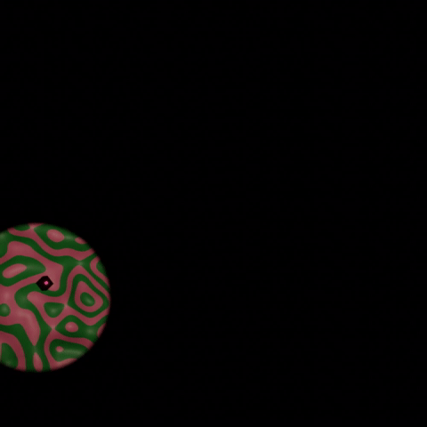

# Musgrave Explorer

There's no reason for this. I think the original idea revolved around how much you can rely on the imagination when creating a world. Power of suggestion, that kind of thing. 

It's ridiculously simple, but I do love what it conjures.

