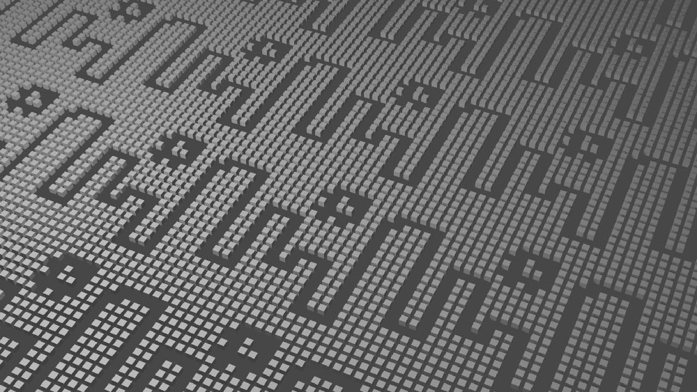

# Pixel Pattern to Mesh

a simplest possible geometry node network that takes black and white pixel art and renders it in 3D.  Originally dreamed up as a possible companion to the [Pixel Pattern Creator](https://laffan.github.io/pixel-pattern-creator/).

