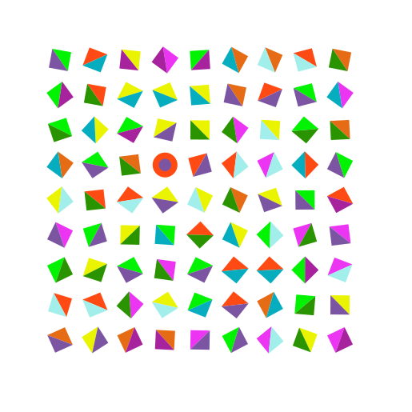

# The Shape Forest

This came after my first trial use of [Pattern Nodes](https://www.lostminds.com/patternodes3/), a fantastic bit of software that allows you to create images parametrically. I exported the SVG then extruded it in Blender before animating a flythrough camera.  

The original image.
