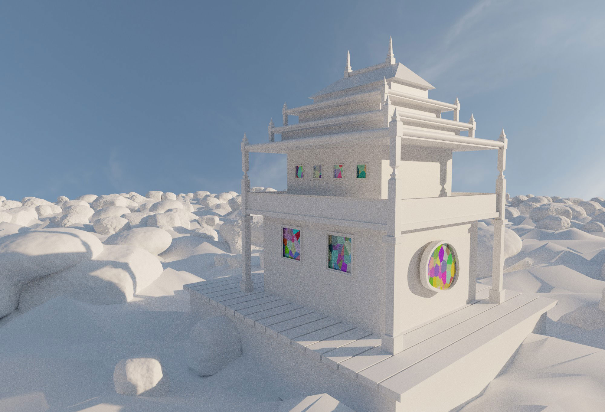

# Wasteland Temple

An early project where emphasis was just on rapidly modeling forms and then lighting them to see how quickly I could construct something that felt like a real building. 

The geometry nodes which scatter the rocks respect a mask, which prevents instances from being placed around the building.

